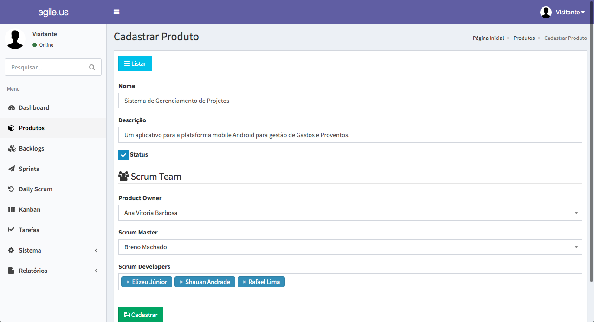

# Agile.us

A simple application for Project Management that uses Scrum and Kanban concepts.

## Screenshot
- Dashboard: Shows indicators

- Product: Form create for Product

- Backlogs: Show backlogs List

- Sprint: Show Sprints List

- DailyScrum: Form create for DailyScrum

- Kanban: Show Kanban board(Draggable)

- Rules: Show default rules for Scrum

## Technologies
- PHP
- Yii2 Framework
- MySQL  

## Dev dependencies
- none

## See more
For more information about me or other projects: [brenomachado.dev](https://brenomachado.dev)